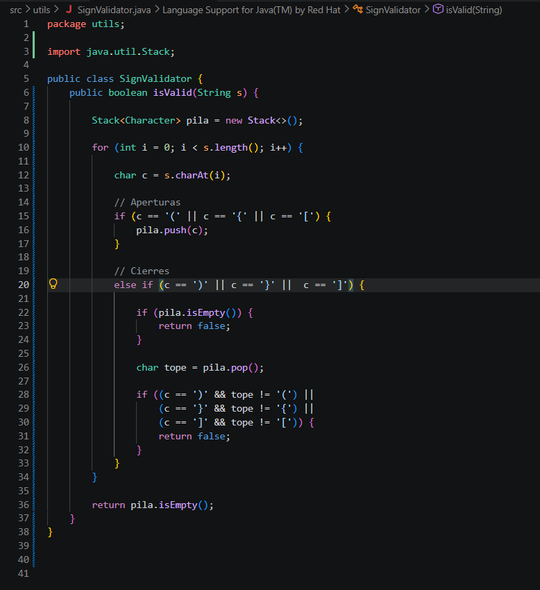
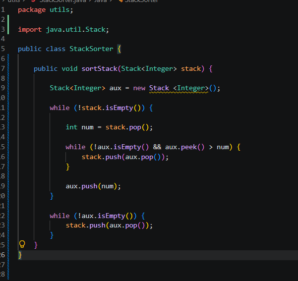
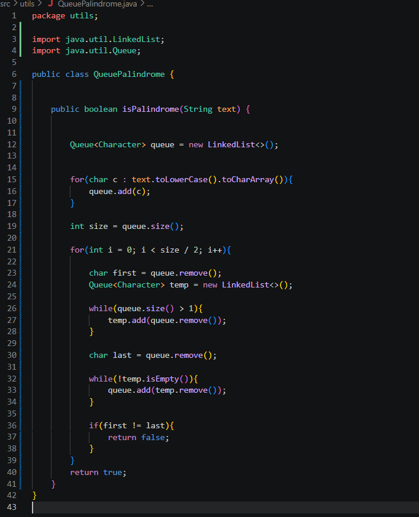
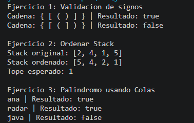

# Ejercicios - pilas - colas 
## Nombres:

|---|
| Sebastian Alvarez |
| Sebastian Muñoz |
| Emilio Montaleza |

---
## Descripción del proyecto: 

Este proyecto implementa diferentes algoritmos utilizando estructuras de datos lineales proporcionadas por Java Collections Framework.

El desarrollo se enfoca en el manejo de estructuras dinámicas mediante las interfaces:

- `Stack`
- `Queue`

Aplicando sus operaciones fundamentales para resolver problemas de procesamiento de información.

Las estructuras utilizadas se basan en los siguientes modelos:

| Estructura | Principio | Descripción |
|---|---|---|
| Stack | LIFO | El último elemento agregado es el primero en ser eliminado |
| Queue | FIFO | El primer elemento agregado es el primero en ser procesado |

---
## Ejercicio 1
Para resolver este problema se utilizó una estructura de datos Stack (Pila), la cual funciona bajo el principio LIFO (Last In, First Out), es decir, el último elemento que entra es el primero en salir.

El algoritmo recorre la cadena carácter por carácter. Cuando encuentra un símbolo de apertura ((, {, [), lo almacena en la pila utilizando la operación push().

Cuando encuentra un símbolo de cierre (), }, ]), verifica si la pila está vacía. Si la pila está vacía, significa que no existe un símbolo de apertura correspondiente y la cadena es inválida. En caso contrario, extrae el elemento superior mediante pop() y comprueba que ambos símbolos formen un par correcto.

Al finalizar el recorrido, si la pila se encuentra vacía, la cadena es válida; de lo contrario, existen símbolos de apertura sin cerrar y la cadena es inválida.

##  Funcionamiento del Algoritmo
1. Recorrer la cadena de izquierda a derecha.
2. Insertar en la pila cada símbolo de apertura encontrado.
3. Al encontrar un símbolo de cierre:
4. Verificar que la pila no esté vacía.
5. Extraer el elemento superior.
6. Comprobar que corresponda al tipo correcto de apertura.
7. Continuar hasta terminar la cadena.
8. Si la pila queda vacía, la cadena es válida.

### Captura del ejercicio 

---
## Ejercicio 2
En este ejercicio se implementó un algoritmo para ordenar una pila de números enteros utilizando únicamente las operaciones de la estructura Stack. El objetivo es que los elementos más pequeños queden en el tope de la pila.

La solución utiliza una pila auxiliar para almacenar temporalmente los elementos mientras se los coloca en el orden correcto. Una vez finalizado el proceso, los elementos se transfieren nuevamente a la pila original, quedando ordenados sin utilizar arreglos, listas u otras estructuras de datos.

### Restricciones cumplidas
1. Se ordena la misma pila recibida como parámetro.
2. No se retorna una nueva pila.
3. Se utiliza únicamente una pila auxiliar.
4. No se emplean arreglos, listas ni otras estructuras de datos.
5. Solo se utilizan las operaciones push(), pop(), peek() e isEmpty().

### Captura del ejercicio 

---
## Ejercicio 3

Este ejercicio implementa un algoritmo para determinar si una cadena de texto es un palíndromo utilizando la estructura de datos lineal **Queue (Cola)**.

Una cola trabaja bajo el principio **FIFO (First In, First Out)**, donde el primer elemento que ingresa es el primero en ser procesado. Esta característica permite mantener el orden original de los datos almacenados y realizar operaciones de extracción de manera secuencial.

Un palíndromo es una palabra, frase o cadena de caracteres que conserva el mismo orden al ser leída desde ambos sentidos, es decir, de izquierda a derecha y de derecha a izquierda. Para resolver este problema se almacenan los caracteres de la cadena dentro de una cola y se realizan comparaciones entre los elementos correspondientes.

El algoritmo utiliza una estructura `Queue<Character>` para administrar los caracteres ingresados. Cada carácter es agregado mediante la operación `add()`, respetando el orden de llegada. Posteriormente, los elementos son extraídos utilizando `remove()` para comparar los caracteres ubicados en posiciones opuestas de la cadena.

### Funcionamiento del algoritmo

1. Recibir una cadena de texto como entrada.
2. Recorrer la cadena carácter por carácter.
3. Insertar cada elemento dentro de la cola.
4. Obtener los caracteres manteniendo el comportamiento FIFO.
5. Comparar los caracteres extraídos con sus posiciones equivalentes.
6. Determinar si todos los caracteres coinciden.
7. Retornar `true` si la cadena es un palíndromo o `false` en caso contrario.

### Captura del ejercicio 

---
## Salidas esperadas de cada ejercicio 

---
## Conclusiones

- La implementación de estructuras lineales permitió analizar la importancia de seleccionar correctamente una estructura de datos según el problema a resolver. El uso de `Stack` facilitó el manejo de información con comportamiento LIFO, siendo aplicado en la validación de expresiones mediante el control del orden de apertura y cierre de símbolos. Esto permitió reforzar el uso de operaciones como `push()`, `pop()` y `peek()` dentro de un entorno orientado a objetos en Java.

- El desarrollo del algoritmo basado en `Queue` permitió comprender el funcionamiento del modelo FIFO y su aplicación en el procesamiento secuencial de datos. Mediante una cola de caracteres fue posible diseñar una solución para detectar palíndromos, demostrando cómo el orden de inserción y extracción de elementos influye directamente en el resultado del algoritmo.

- La práctica permitió fortalecer el manejo del framework de colecciones de Java y la implementación de soluciones utilizando estructuras dinámicas. Además, se comprobó que una correcta organización del código y el uso adecuado de estructuras auxiliares ayudan a crear algoritmos más claros, mantenibles y adaptados a diferentes necesidades de procesamiento de información.

